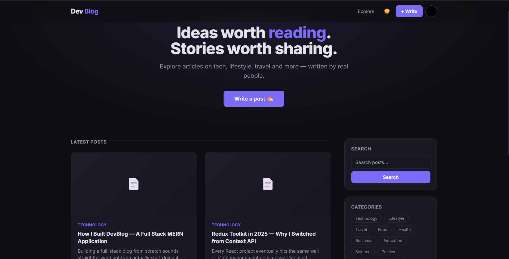
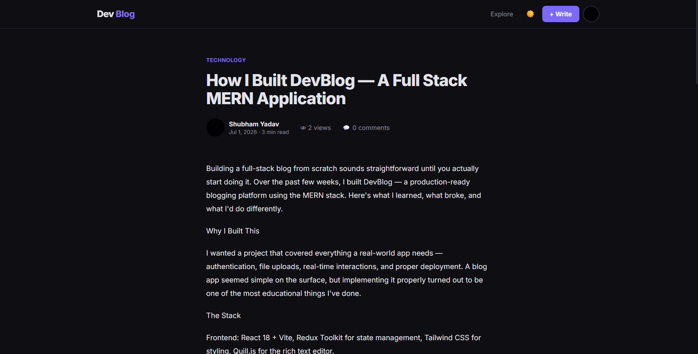
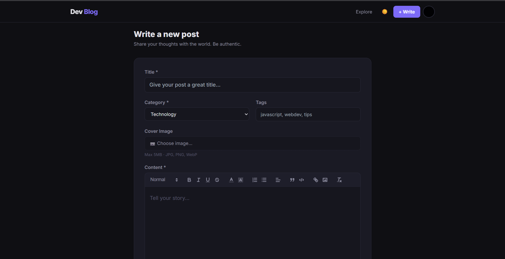
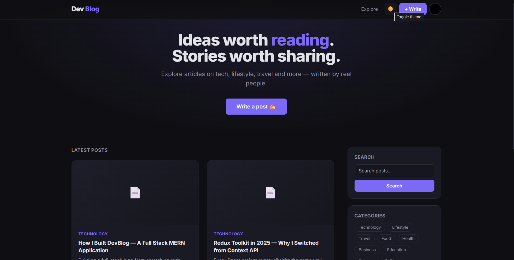
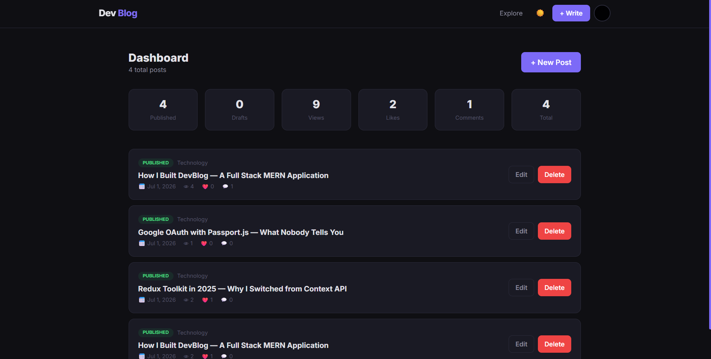

# DevBlog — Full Stack MERN Blog Platform

🔗 **Live Demo:** https://devblog-nine-psi.vercel.app  
📦 **Backend API:** https://devblog-1mlk.onrender.com/api/health  
💻 **GitHub:** https://github.com/Shubham5533/devblog

> ⚠️ Note: Backend is on Render free tier — first request may take 30-50 seconds to wake up.

A production-grade blogging platform built with the MERN stack (MongoDB, Express, React, Node.js) and Redux Toolkit for state management.

## Screenshots

### Home Page


### Single Post


### Rich Text Editor


### Dark Mode


### Dashboard


## ✨ Features

### Authentication
- Email/password signup & login (JWT-based)
- **Google OAuth 2.0** login (Passport.js)
- Persistent sessions via httpOnly cookies + Bearer token fallback
- Change password

### Blog & Content
- **Rich text editor (Quill.js)** — bold, italic, headers, lists, blockquotes, code blocks, inline images
- Create / Read / Update / Delete posts
- **Cover image upload** via Multer + Cloudinary (auto-optimized, falls back to local disk storage)
- Categories (11 types) and free-form tags
- Draft / Published workflow
- Auto-generated slugs, excerpts, and read-time estimates
- Full-text search (title, content, tags)
- Pagination

### Engagement
- Like / unlike posts (optimistic UI)
- Comment system with delete + per-comment likes
- Save posts to read later
- Follow / unfollow authors
- View counter
- Related posts (by category & tags)
- **Email notifications** (Nodemailer) — welcome email on signup, comment notifications to post authors

### UI/UX
- **Dark/Light mode toggle** (persisted, CSS custom properties)
- Fully responsive (mobile, tablet, desktop)
- Skeleton loaders, toast notifications, smooth transitions
- Author profile pages with stats (views, likes, post count)
- Personal dashboard (manage drafts/published posts, analytics)

## 🛠 Tech Stack

**Frontend**
- React 18 + Vite
- Redux Toolkit (auth, posts, UI state slices)
- React Router v6
- Tailwind CSS (dark/light theming via CSS variables)
- Quill.js (rich text editor)
- Axios

**Backend**
- Node.js + Express
- MongoDB + Mongoose
- Passport.js (Local + Google OAuth20 strategies)
- JWT (jsonwebtoken)
- Multer + Cloudinary (`multer-storage-cloudinary`)
- Nodemailer
- bcryptjs, helmet, express-rate-limit, express-validator

## 📁 Project Structure

```
devblog/
├── server/                  # Express API
│   ├── index.js              # Entry point
│   ├── config/
│   │   ├── passport.js       # Local + Google strategies
│   │   └── cloudinary.js     # Multer + Cloudinary setup
│   ├── models/
│   │   ├── User.js
│   │   └── Post.js
│   ├── routes/
│   │   ├── auth.js           # /api/auth/*
│   │   ├── posts.js          # /api/posts/*
│   │   ├── users.js          # /api/users/*
│   │   └── upload.js         # /api/upload/*
│   ├── middleware/auth.js    # JWT protect / optionalAuth
│   ├── utils/email.js        # Nodemailer templates
│   └── .env
│
├── client/                   # React (Vite)
│   └── src/
│       ├── store/
│       │   ├── store.js
│       │   └── slices/       # authSlice, postsSlice, uiSlice
│       ├── components/
│       │   ├── common/       # Navbar, ToastContainer
│       │   ├── blog/         # PostCard, PostCardSkeleton
│       │   └── editor/       # Quill wrapper
│       ├── pages/             # Home, PostDetail, Write, Edit, Login, Register, Profile, Dashboard, Saved
│       └── utils/             # api.js (axios), helpers.js
```

## 🚀 Setup

### Prerequisites
- Node.js v18+
- MongoDB (local or Atlas)
- (Optional) Google OAuth credentials
- (Optional) Cloudinary account
- (Optional) Gmail App Password for emails

### 1. Backend

```bash
cd server
npm install
```

Edit `server/.env`:
```env
MONGO_URI=mongodb://localhost:27017/devblog
JWT_SECRET=your_random_secret_min_32_chars
CLIENT_URL=http://localhost:5173

# Google OAuth — https://console.cloud.google.com/apis/credentials
GOOGLE_CLIENT_ID=...
GOOGLE_CLIENT_SECRET=...
GOOGLE_CALLBACK_URL=http://localhost:5000/api/auth/google/callback

# Cloudinary — https://cloudinary.com/console (optional, falls back to local storage)
CLOUDINARY_CLOUD_NAME=...
CLOUDINARY_API_KEY=...
CLOUDINARY_API_SECRET=...

# Gmail — generate App Password at myaccount.google.com/apppasswords (optional)
GMAIL_USER=you@gmail.com
GMAIL_APP_PASS=...
```

```bash
npm run dev    # nodemon
# or
npm start
```

Server runs on `http://localhost:5000`.

### 2. Frontend

```bash
cd client
npm install
npm run dev
```

App runs on `http://localhost:5173`, proxying `/api` requests to the backend.

## 🔑 Setting up Google OAuth

1. Go to [Google Cloud Console](https://console.cloud.google.com/apis/credentials)
2. Create OAuth 2.0 Client ID (Web application)
3. Authorized redirect URI: `http://localhost:5000/api/auth/google/callback`
4. Copy Client ID & Secret into `server/.env`

## ☁️ Setting up Cloudinary (optional)

If you skip this, images are stored locally in `server/uploads/` — works fine for development but won't persist on most free hosting tiers (Render free disk is ephemeral). For production, set up a free Cloudinary account and add the three keys to `.env`.

## 📧 Setting up Email (optional)

1. Enable 2FA on your Gmail account
2. Generate an [App Password](https://myaccount.google.com/apppasswords)
3. Add `GMAIL_USER` and `GMAIL_APP_PASS` to `.env`

Without this configured, emails are simply skipped (logged to console) — the app still works fully.

## 🌐 Deployment

**Backend (Render):**
- New Web Service → root dir `server`
- Build: `npm install` · Start: `npm start`
- Add all `.env` variables in Render's dashboard
- Update `GOOGLE_CALLBACK_URL` and `CLIENT_URL` to production URLs

**Frontend (Vercel):**
- Root dir `client`
- Build: `npm run build` · Output: `dist`
- Add `VITE_API_URL` pointing to your deployed backend, and update the axios baseURL / vite proxy accordingly for production builds

**MongoDB:** Use MongoDB Atlas free tier for production.

## 📝 License

MIT — free to use for learning, portfolio, or resume projects.
